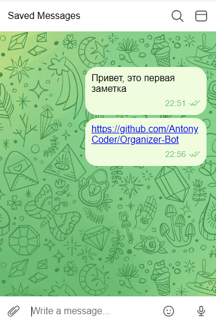
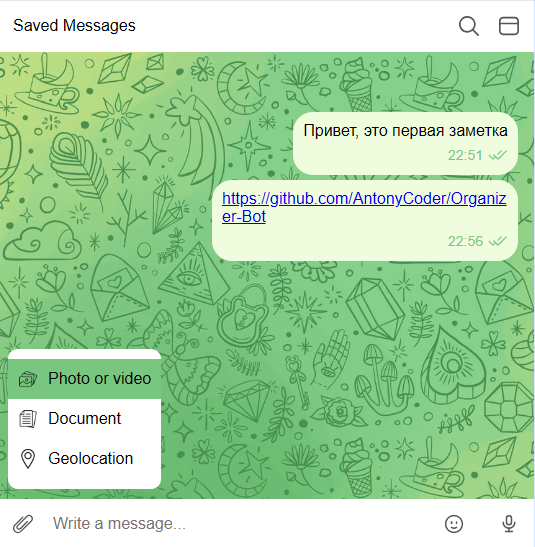
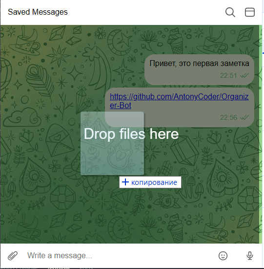
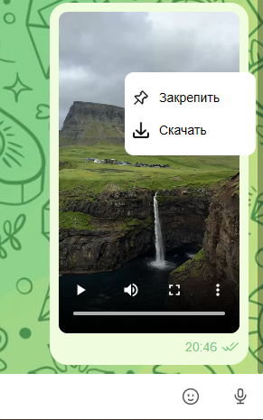
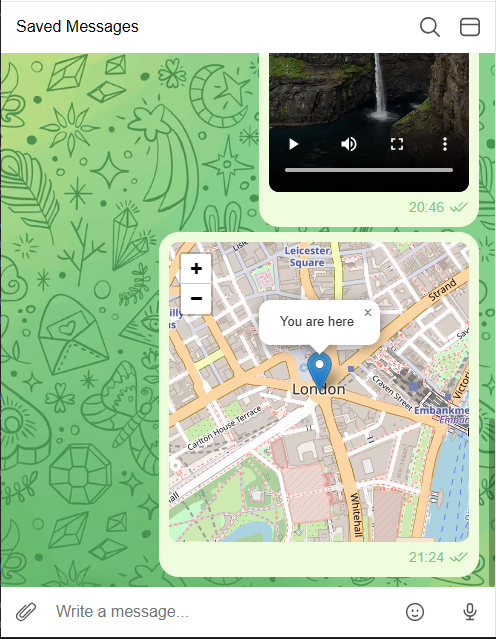
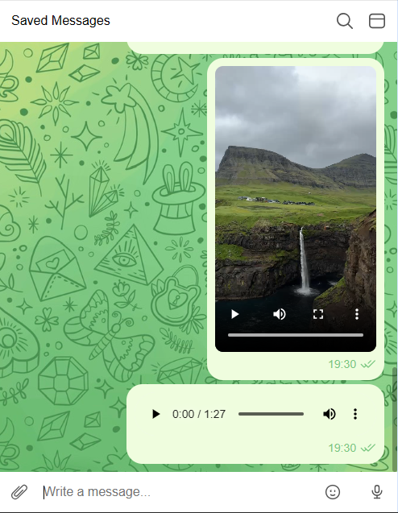
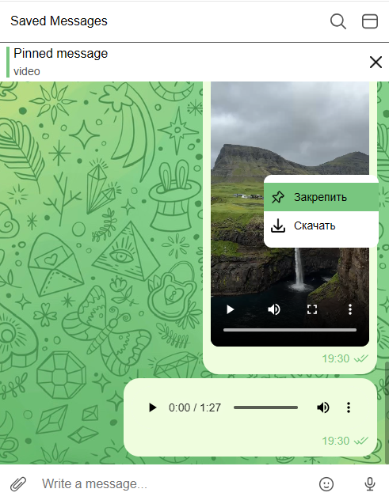
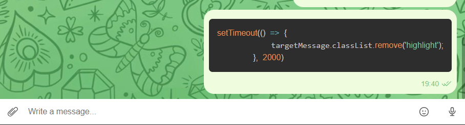
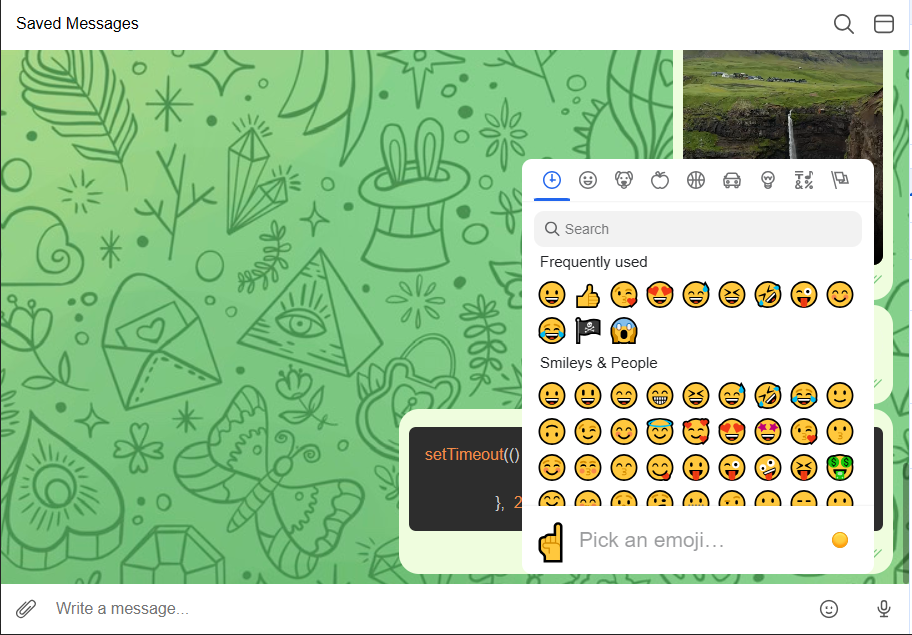

# Веб приложение чат для сохранения важной информации

Современное веб-приложение для сохранения сообщений, файлов, медиа контента и даже геолокаций, с богатым набором функций. Проект демонстрирует использование современных веб-технологий и популярных библиотек для создания полнофункционального интерфейса.

## 📋 Описание проекта

Это полнофункциональное чат-приложение, построенное на современном стеке технологий с использованием JavaScript (ES6+), SCSS и Webpack 5. Приложение предоставляет пользователям возможность сохранения различных сообщений, включая текст, медиафайлы, документы, геолокацию и блоки кода. Архитектура проекта основана на компонентном подходе, что обеспечивает модульность и легкость поддержки кода.

## 🚀 Основные возможности

### 💬 1. Сохранение в истории ссылок и текстовых сообщений
- **Текстовые сообщения**: Поддержка обычного текста с автоматическим распознаванием и кликабельными ссылками
- **История сообщений**: Все сообщения сохраняются в истории чата для последующего просмотра
- **Форматирование времени**: Использование библиотеки **Day.js** для корректного отображения времени отправки сообщений


### 🔗 2. Работа с ссылками
- Автоматическое распознавание ссылок в формате `http://` и `https://`
- Кликабельные ссылки с визуальным выделением
- Возможность открытия ссылок в новой вкладке браузера
- Интеграция с системой обработки текста для автоматического преобразования URL в кликабельные элементы


Изображения для 1 и 2 пункта

### 📁 3. Сохранение в истории изображений, видео и аудио (как файлов) — через Drag & Drop и через иконку загрузки; 


- **Drag & Drop**: Интуитивная загрузка файлов перетаскиванием с визуальной обратной связью
- **Загрузка через иконку**: Альтернативный способ загрузки через интерфейс с поддержкой множественного выбора. Можно выбрать файлы нажатием на кнопку скрепки, либо при наведении на нее появляется элемент для выбора типа загружаемых файлов в том числе геолокации.

  

### 4. Скачивание файлов на компьютер пользователя
- **Скачивание файлов**: Возможность скачивания загруженных файлов на компьютер пользователя



### 5. Ленивая подгрузка: сначала подгружаются последние 10 сообщений, при прокрутке вверх подгружаются следующие 10 и т. д.
- **Ленивая подгрузка**: Оптимизация производительности через постепенную загрузку сообщений
- Начальная загрузка последних 10 сообщений для быстрого старта
- Автоматическая подгрузка следующих 10 сообщений при прокрутке вверх

### 6. 📍 Отправка геолокации;
- Отправка текущего местоположения пользователя с использованием HTML5 Geolocation API
- **Интеграция с Leaflet.js**: Интерактивные карты с возможностью масштабирования и навигации
- Отображение координат и адреса с возможностью открытия в внешних картографических сервисах
- Кастомные маркеры и стилизация карт



### 7. Воспроизведение видео/аудио, используя API браузера;
- **Воспроизведение видео**: Встроенный видеоплеер с использованием HTML5 Video API
- **Воспроизведение аудио**: Аудиоплеер с элементами управления (play/pause, прогресс-бар, громкость)




### 📌 8. Закрепление сообщений
- Возможность закрепления важных сообщений в верхней части чата
- Поддержка только одного закрепленного сообщения
- Анимация при нажатии на закрепленное сообщение, чат перемещается на него и подсвечивает сообщение



### 💻 9. Поддержка кода
- **Интеграция с Prism.js**: Профессиональная подсветка синтаксиса для различных языков программирования
- **Поддерживаемые языки**: JavaScript
- **Темная тема**: Использование темы "prism-tomorrow" для комфортного чтения кода
- Специальное оформление для блоков кода с распознаванием по маркерам ```language



### 😊 10. Поддержка эмодзи
- **Интеграция с Emoji Mart**: Полнофункциональная панель выбора смайликов с поиском и категориями
- **Поддержка Unicode**: Совместимость с эмодзи на различных платформах и устройствах
- **Категоризация**: Организация эмодзи по категориям (лица, животные, еда, активность и др.)
- **Поиск**: Быстрый поиск нужного эмодзи по названию или описанию
- **Кастомные данные**: Использование @emoji-mart/data для локализации и кастомизации



## 🛠 Технологический стек

### Frontend
- **JavaScript (ES6+)**: Современный синтаксис с поддержкой классов и стрелочных функций
- **SCSS**: Препроцессор CSS с переменными, миксинами и вложенностью
- **HTML5**

### Сборка и инструменты
- **Webpack 5**: Модульный сборщик с поддержкой горячей перезагрузки
- **Babel**: Транспиляция современного JavaScript для совместимости с браузерами

### Библиотеки и зависимости
- **Emoji Mart (5.6.0)**: Компонент выбора эмодзи с богатым функционалом
- **@emoji-mart/data (1.2.1)**: Данные для локализации и кастомизации эмодзи
- **Prism.js (1.30.0)**: Библиотека подсветки синтаксиса с поддержкой множества языков
- **Leaflet (1.9.4)**: Интерактивные карты с поддержкой различных провайдеров
- **Day.js (1.11.13)**: Легковесная библиотека для работы с датами и временем

### Дополнительные инструменты
- **Faker.js**: Генерация тестовых данных для разработки

## 🚀 Установка и запуск

### Установка зависимостей
```bash
# Клонирование репозитория
git clone [repository-url]
cd client

# Установка зависимостей
npm install
```

### Запуск в режиме разработки
```bash
# Запуск dev-сервера с горячей перезагрузкой
npm start

# Приложение будет доступно по адресу: http://localhost:8080
```

### Сборка для продакшена
```bash
# Создание оптимизированной сборки
npm build

# Файлы будут созданы в папке dist/
```

## 📁 Структура проекта

```
client/
├── src/
│   ├── js/
│   │   ├── components/          # Компоненты интерфейса
│   │   │   ├── ChatArea/        # Основная область чата
│   │   │   ├── ChatBot/         # Компонент бота
│   │   │   ├── ContextMenu/     # Контекстное меню
│   │   │   ├── Header/          # Заголовок приложения
│   │   │   ├── InputBar/        # Панель ввода с эмодзи
│   │   │   ├── PinMessage/      # Закрепленные сообщения
│   │   │   ├── Message/         # Компоненты сообщений
│   │   │   │   | messagesScripts/     # Скрипты сообщений
│   │   │   │   └── messages/          # Типы сообщений
│   │   │   │       ├── AudioMessage/    # Аудио сообщения
│   │   │   │       ├── FileMessage/     # Файловые сообщения
│   │   │   │       ├── ImageMessage/    # Изображения
│   │   │   │       ├── LocationMessage/ # Геолокация
│   │   │   │       ├── TextMessage/     # Текстовые сообщения
│   │   │   │       └── VideoMessage/    # Видео сообщения
│   │   ├── helpers/             # Вспомогательные функции
│   │   └── utils/               # Утилиты и API
│   │       ├── mapLocation/     # Работа с картами (Leaflet)
│   │       ├── messageActions/  # Действия с сообщениями
│   │       └── messageApi/      # API для работы с сообщениями
│   ├── assets/
│   │   ├── css/                 # SCSS стили
│   │   ├── img/                 # Изображения и иконки
│   │   └── svg/                 # SVG иконки
│   └── index.html              # Главная страница
├── webpack.common.js           # Общая конфигурация Webpack
├── webpack.dev.js              # Конфигурация для разработки
├── webpack.prod.js             # Конфигурация для продакшена
└── package.json                # Зависимости и скрипты
```

## 🔧 Конфигурация библиотек

### Emoji Mart
```javascript
import { Picker } from 'emoji-mart';
import data from '@emoji-mart/data';

// Настройка панели эмодзи
const picker = new Picker({
  data: data,
  onEmojiSelect: (emoji) => {
    // Обработка выбора эмодзи
  }
});
```

### Prism.js
```javascript
import Prism from 'prismjs';
import "prismjs/themes/prism-tomorrow.css";
import "prismjs/components/prism-javascript.js";

// Подсветка синтаксиса
Prism.highlightElement(codeElement);
```

### Leaflet
```javascript
import L from 'leaflet';
import "leaflet/dist/leaflet.css";

// Создание карты
const map = L.map('map').setView([lat, lng], zoom);
```

---

**Разработано с ❤️ для изучения современных веб-технологий**

*Используемые технологии: JavaScript ES6+, SCSS, Webpack 5, Emoji Mart, Prism.js, Leaflet, Day.js*